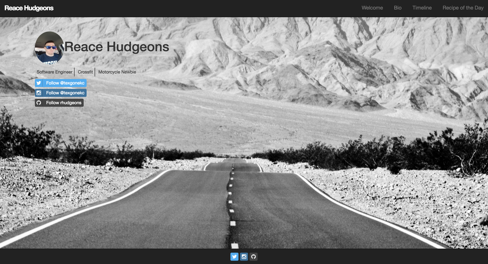
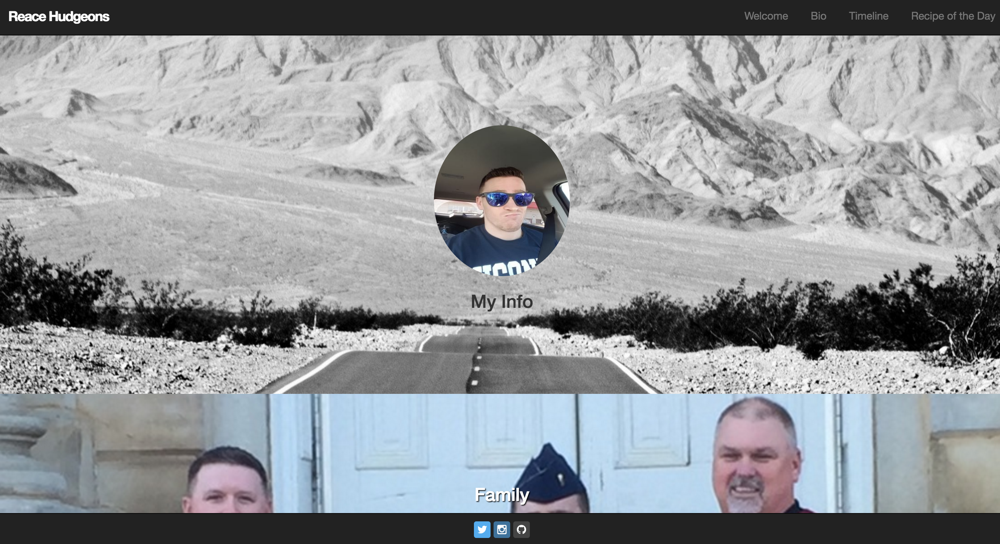
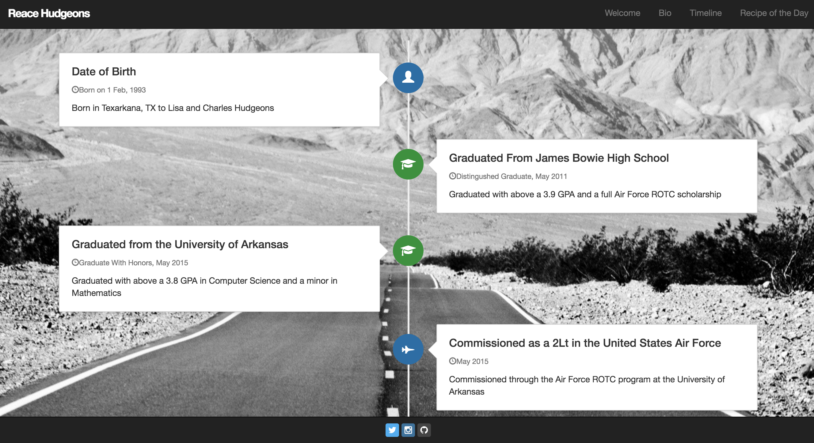
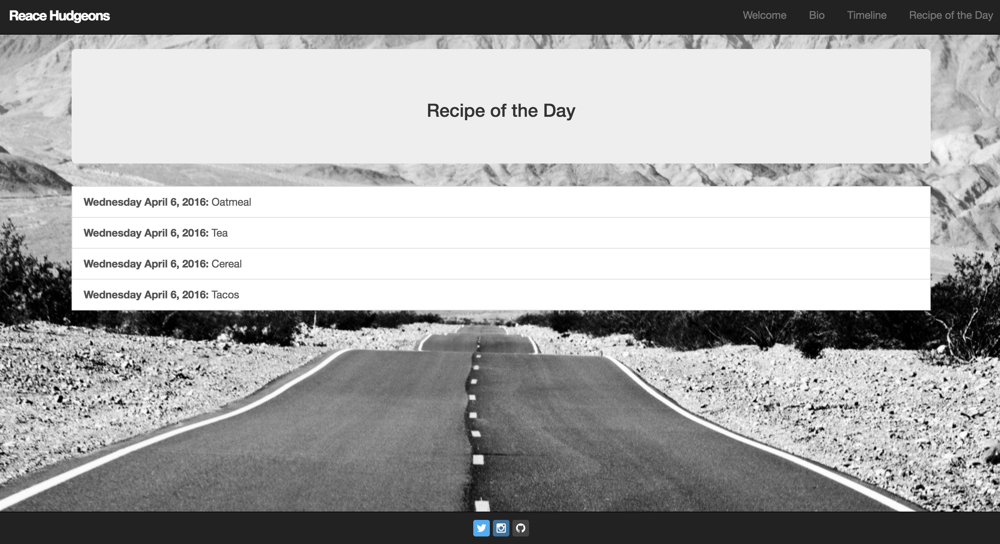
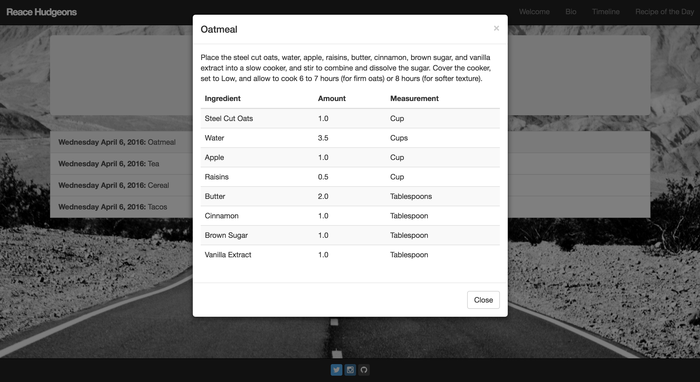
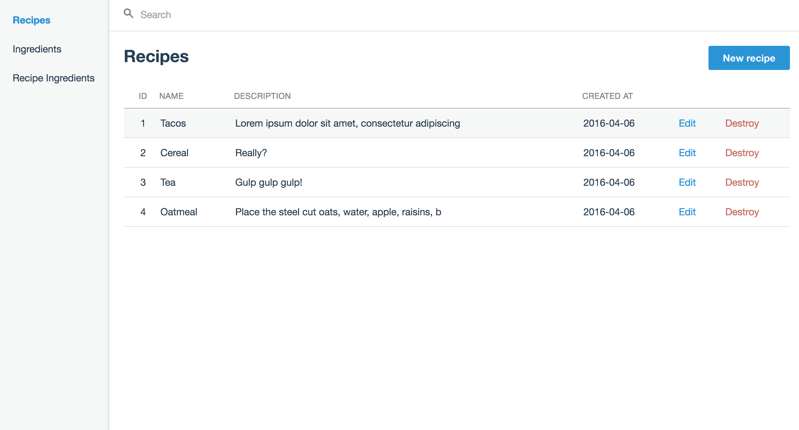

# My Personal Website

### Purpose
I wanted to continue to work with, and learn, Ruby On Rails. I also wanted to see if I could make a website for myself. This is not deployed yet so you have to view locally.

### Pages
* Welcome
  * shows my name with a small profile picture
  * very short description
  * button links to my online accounts

* Bio
  * short sections describing my life

* Timeline
  * a condensed version of the bio page
  * shows when things happened on a vertical timeline

* Recipe Of The Day
  * displays a list of different recipes that I like
  * presents info in a modal
  * has description and an ingredient table

* Admin
  * page to add new items to tables in the database for recipes

### Built Using
  * [Ruby On Rails](http://rubyonrails.org/)
  * [Bootstrap](http://getbootstrap.com/)
  * [Administrate](https://github.com/thoughtbot/administrate)
  * Rspec
  * [Font Awesome](http://fortawesome.github.io/Font-Awesome/icons/#brand)
  * SQLite